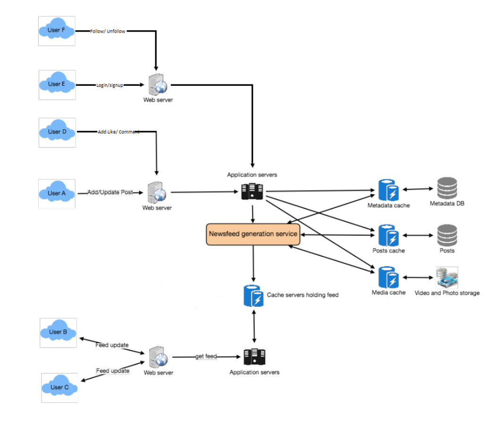

# Social Media Webapp

## 1. System Architecture Diagram

## 2. Functional Requirements

- Creat an account (Sign Up):
  - First Name
  - Last Name
  - Date of Birth
  - Email
  - Username
  - Password
  - Profile Image (using an image file)
- Log In:
  - Username
  - Password
    (Handle login sesion using JWT or session)
- View and Update user information.

- Follow/Unfollow other users
- Create/Edit/Delete a post (others dont have those permissions for that post but they can Like and Comment on that post)

## 3. Model Definition

## 4. Back-of-the-envelope Estimation

## 5. Bottleneck Identification
